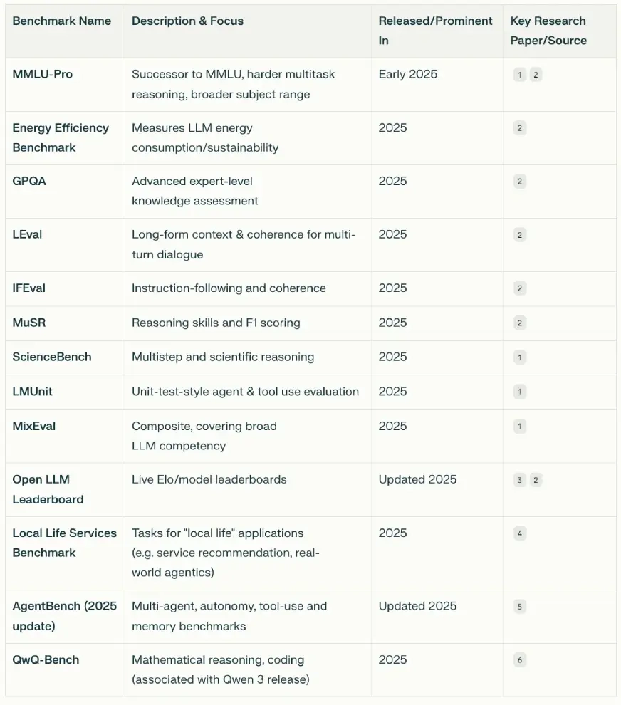
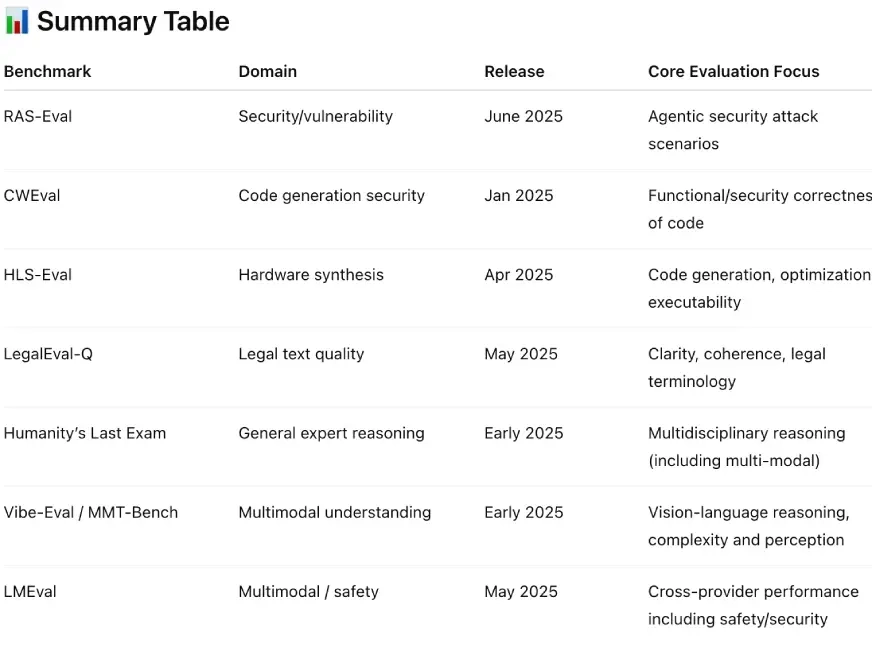
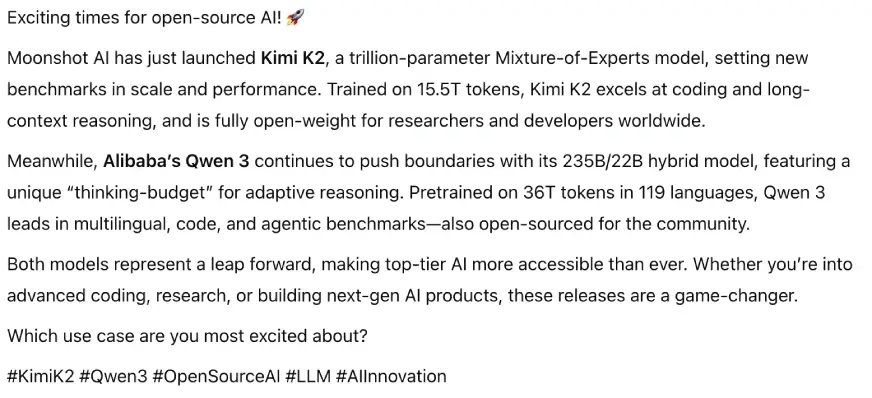
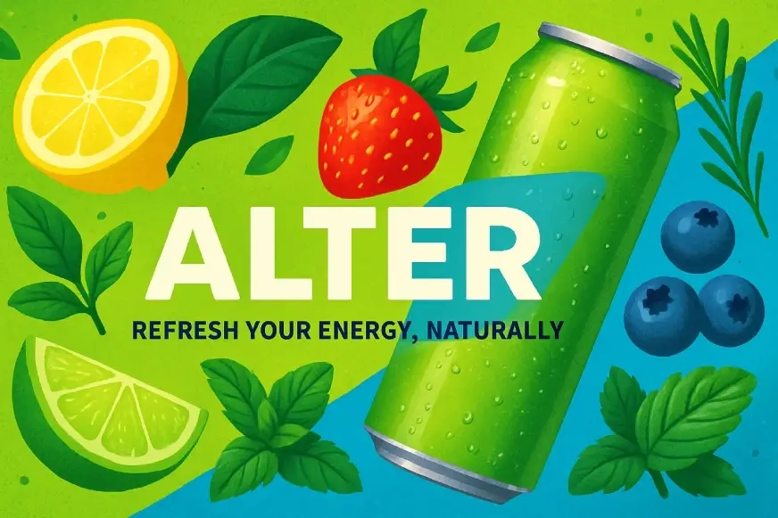
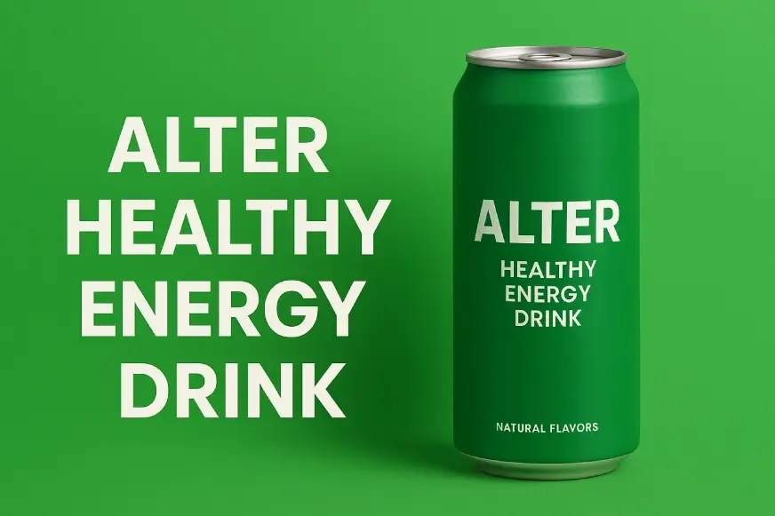

# Perplexity Pro vs ChatGPT Plus：2025年谁才是你的最佳AI助手？

你有没有这种感觉：订阅了一堆AI工具，却不知道该用哪个？每次遇到问题都要纠结半天——"这个问题该问Perplexity还是ChatGPT？"别急，我最近花了点时间把这两个工具拿出来做了个实战对比。不是那种看技术参数的枯燥测试，而是真刀真枪地让它们干活，看看谁更靠谱。

---

## 先说说这俩是干嘛的

Perplexity就像一个会实时上网的聪明学生，你问它什么，它都能现场去查资料给你答案。ChatGPT呢，更像个博学的老师，脑子里装了一堆知识，但有时候也会"知识过时"。

它们都有免费版，但跑这些大模型太费钱了（你想想那些GPU服务器的电费账单）。所以两家都推出了付费套餐：Perplexity有Pro版（20美元/月）和Premium版（200美元/月），ChatGPT也是Plus和Pro两档，价格一样。

## 先看看配置有啥不同

**模型选择这块：**

ChatGPT只给你用自家的OpenAI模型，就像苹果生态——封闭但稳定。Perplexity就开放多了，OpenAI、Gemini、Claude的模型都能用，还有自己的"Sonar"模型。

不过有个小问题：ChatGPT选好模型就一直能用，Perplexity有时候你想用的模型突然不可用了，得临时换一个。ChatGPT默认用GPT-4o，Perplexity则是"Best"模式——让系统自己判断用哪个最合适。

## 五个真实场景实测

废话不多说，直接上真格的。我拿了五个常见任务来测试它们。

### 场景一：查资料

我让它们找2025年发布的LLM评估基准和相关论文。

**Perplexity的表现：**
用了"Best"模式，自动选模型。结果给了个漂亮的汇总表，但缺少关键的论文链接——看着挺唬人，想深入研究就抓瞎了。

**ChatGPT的表现：**
用GPT-4o加网页搜索，先解释了一遍基准测试，最后总结。虽然格式没那么花哨，但每个论文都附带了链接，想验证信息特别方便。

**这轮：ChatGPT赢。** 查资料这事儿，能找到源头比好看重要。

### 场景二：写个LinkedIn帖子

让它们写一篇关于Kimi和Qwen最新模型的帖子。

**Perplexity（用GPT-4.1）：**
给出了结构清晰的内容，最后还有个对比表格，直接就能复制粘贴发布。

**ChatGPT（用GPT-4.1）：**
纯文字输出，读起来像篇小作文，发LinkedIn之前还得自己排版。

**这轮：Perplexity完胜。** 做社交媒体内容，直接拿来就能用才是王道。

如果你经常需要创作内容或做研究，👉 [Perplexity Pro年费成品号](https://shaoyumi.com/buy/64) 能让你的工作效率提升一个档次，24小时自动发货，365天质保让你用得安心。

### 场景三：设计社交媒体海报

让它们为一款叫"Alter"的健康能量饮料设计宣传海报。

**Perplexity：**
加了很多元素和标语，但能量饮料瓶本身反而被淹没了——有点用力过猛的感觉。

**ChatGPT：**
简单粗暴，把提示词直接放图上，但饮料瓶很突出。两个都处理好了文字和绿色调。

**这轮：Perplexity赢。** 虽然有点花哨，但营销海报就得这么玩。

### 场景四：写代码

让它们做一个冰淇淋订购网页，要能输入名字、选容器类型和口味，还要实时显示总价。

**Perplexity：**
代码看起来不错，在Google Colab里跑起来了，但总价不更新——关键功能坏了。

**ChatGPT：**
界面有点乱，但功能完整，总价计算准确。虽然没Perplexity好看，但至少能用。

**这轮：ChatGPT赢。** 写代码这事儿，能跑起来比好看重要得多。

### 场景五：分析文档

给它们三份文档，让它们做个简单易懂的汇总表。

**Perplexity：**
生成了一个超详细的表格，涵盖工具的各个方面，信息密度很高但不难读。

**ChatGPT：**
表格简单，但有一份文档的摘要不太准确——这可不行。

**这轮：Perplexity轻松拿下。** 处理文档这块，它确实有一套。

---

## 说点实话

测完之后我得承认，Perplexity Pro真是个惊喜。本来我以为它可能就是个凑合能用的工具，但实际体验下来，很多时候输出质量能跟ChatGPT Plus打个平手，甚至在某些场景下更胜一筹。

当然它也不完美——有时候你想用的模型突然不可用，"实验室"功能有时候反应慢。但整体来说，如果你手头正好有Perplexity Pro的使用权限，我觉得你会喜欢上它的。

如果你正在纠结选哪个，我的建议是：**需要深度研究和编程就用ChatGPT Plus，做内容创作和文档分析就选Perplexity Pro。** 预算够的话，两个都订阅其实也不亏——毕竟术业有专攻。想快速体验Perplexity Pro的强大功能？👉 [立即获取Perplexity Pro年费成品号](https://shaoyumi.com/buy/64)，让AI真正成为你的日常助手。
